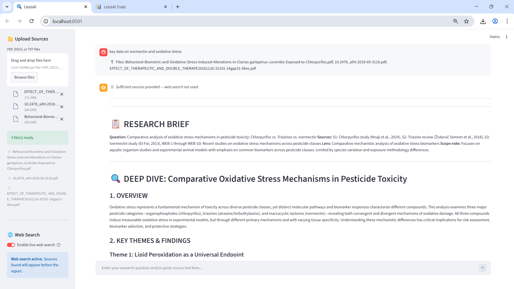
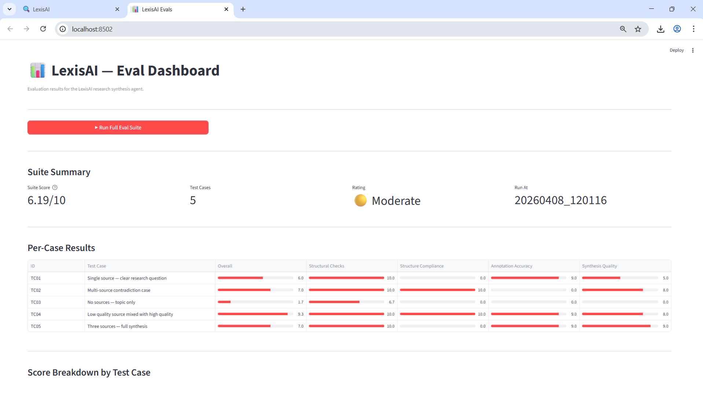

# 🔍 LexisAI

**Research synthesis with explicit attribution, contradiction handling, and measurable quality**

LexisAI transforms raw source material; PDFs, documents, pasted text, into
structured, claim-annotated research reports. Every finding is traced to a
specific source, an inference, or general knowledge. Nothing is blended without
attribution.




---

## Why LexisAI Exists

Most AI tools treat research as a retrieval problem. Find something relevant,
summarize it, move on.

That is not how good research works.

Good research is a synthesis problem. You have multiple sources that agree on
some things, contradict each other on others, and leave gaps that neither
addresses. The value is not in summarizing each source, it is in understanding
what they mean *together*.

LexisAI was built on a different premise:

**Every claim should be traceable.** Not just attributed at the end in a
footnote, but tagged inline — `[S1]`, `[S2]`, `[inferred]`,
`[general knowledge]` — so you can see exactly where each piece of the
analysis came from.

**Contradiction is information.** When two sources disagree, most tools smooth
it over. LexisAI treats it as a primary finding. The contradiction section
exists because unresolved disagreements between credible sources are often
the most important thing a researcher needs to know.

**Uncertainty should be stated, not hidden.** Synthesis statements are written
to the level of the evidence. Strong evidence produces strong conclusions.
Thin evidence produces hedged conclusions with explicit gaps. An AI that
overstates certainty is not a research tool — it is a liability.

**Quality should be measurable.** A system that cannot be evaluated cannot be
trusted. LexisAI ships with a public evaluation framework; test cases,
scoring rubrics, and real results — so you can see how it performs, not just
how it is described.

This repository exposes the public, verifiable layer of that system.

---

## What LexisAI Is Not

- Not a chatbot
- Not a citation generator
- Not a summarization tool

LexisAI is a synthesis system with a fixed output contract, explicit attribution, and measurable quality.

---

## What This Repository Contains

```
lexis-ai-public/
├── docs/           System architecture, methodology, evaluation, limitations
├── examples/       Real inputs, real outputs, real eval results
├── lexis-ai/       Public SDK — clean interface to the synthesis pipeline
├── interfaces/     Contracts defining expected agent behavior
├── stubs/          Runnable placeholders for local exploration
├── evals_public/   Light evaluation suite with public test cases
└── scripts/        Demo runner and output reproduction scripts
```

This repository provides full transparency into:

- Full system architecture and design decisions
- Output schema and annotation contract
- Real example inputs and outputs
- Evaluation methodology and sample results
- A runnable stub pipeline that demonstrates structure without exposing the
  core synthesis engine

The core synthesis engine, prompt system, LLM-as-judge implementations, and
model routing heuristics are proprietary and remain private.

---

## Quickstart

```bash
git clone https://github.com/ChuksForge/lexis-ai-public
cd lexis-ai-public
pip install -r requirements.txt
cp .env.example .env
# Add your ANTHROPIC_API_KEY to .env

# Run the stub demo
python scripts/run_demo.py

# Reproduce a saved example
python scripts/reproduce_example.py
```

---

## Verification & Reproducibility

This repository is designed for independent verification of LexisAI’s behavior.

**To verify:**
1. Inspect `/examples/inputs` — real research questions and source material
2. Compare with `/examples/outputs` — the reports those inputs produced
3. Read `/docs/evaluation.md` — how output quality is measured
4. Run `scripts/reproduce_example.py` — replays a saved pipeline locally
5. Review `/evals_public/scoring_rubric.md` — the criteria applied to every report

**What you can confirm:**
- Every output follows the documented schema exactly
- Every claim in every example output is annotated `[S1]`, `[inferred]`, etc.
- Contradiction sections are populated when sources disagree
- Synthesis statements are scoped to the evidence provided
- Eval scores align with the rubric in the docs

**What remains private:**
- The system prompt and prompt architecture
- The core `research()` and `research_with_search()` implementations
- LLM-as-judge prompts and scoring logic
- Model routing heuristics

---

## Output Schema

Every LexisAI report follows this fixed structure:

```
📋 RESEARCH BRIEF
  Question      — stated or inferred
  Sources       — S1: type/description, WEB-1: title/url, ...
  Lens          — specified or "Balanced multi-perspective"
  Scope note    — coverage and limitations

🔍 DEEP DIVE: [Research Question]

  1. OVERVIEW
  2. KEY THEMES & FINDINGS    ← every claim annotated [S1][S2][inferred]
  3. CROSS-SOURCE ANALYSIS
     ├── Points of Agreement
     ├── Points of Contradiction
     └── Gaps in the Evidence
  4. INSIGHT RANKING          ← ordered by evidential strength
  5. OPEN QUESTIONS
  6. SYNTHESIS STATEMENT      ← scoped to evidence, uncertainty explicit
  7. SUGGESTED NEXT STEPS
```

Schema definition: [`lexis-ai/schemas.py`](lexis-ai/schemas.py)

Sample: 
---

## Annotation System

| Tag | Meaning |
|---|---|
| `[S1]`, `[S2]` | Claim traceable to a specific user-provided source |
| `[WEB-1]`, `[WEB-2]` | Claim from a live web search result |
| `[inferred]` | Logical inference beyond provided sources |
| `[general knowledge]` | Drawn from model training, not provided material |

No claim is presented as sourced if it cannot be traced to provided material.

---

## Evaluation

LexisAI outputs are evaluated across four dimensions:

| Dimension | Method |
|---|---|
| Structural compliance | Hardcoded checks — required sections present |
| Annotation accuracy | Rubric-based — claim tagging correctness |
| Synthesis quality | Rubric-based — 6 sub-criteria |
| Evidence weighting | Rubric-based — insights ranked by strength |

Full methodology: [`docs/evaluation.md`](docs/evaluation.md)
Sample results: [`examples/eval_runs/`](examples/eval_runs/)



---

## Hosted Product

The full LexisAI system — complete synthesis engine, live web search,
PDF export, and managed infrastructure — is in private access.

**Interested in early access or a technical walkthrough?**
→ [Connect on Telegram](https://t.me/ChuksForge), Email: chuksprompts@email.com
or [Twitter](https://x.com/ChuksForge)

---

## License

MIT License for the public SDK, interface definitions, schemas, stubs,
and documentation.

The core LexisAI synthesis engine is proprietary and not included
in this repository.

---

*Built by [ChuksForge](https://chuksforge.github.io)*
